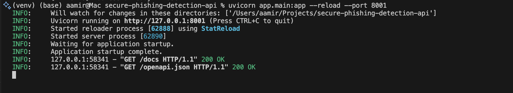
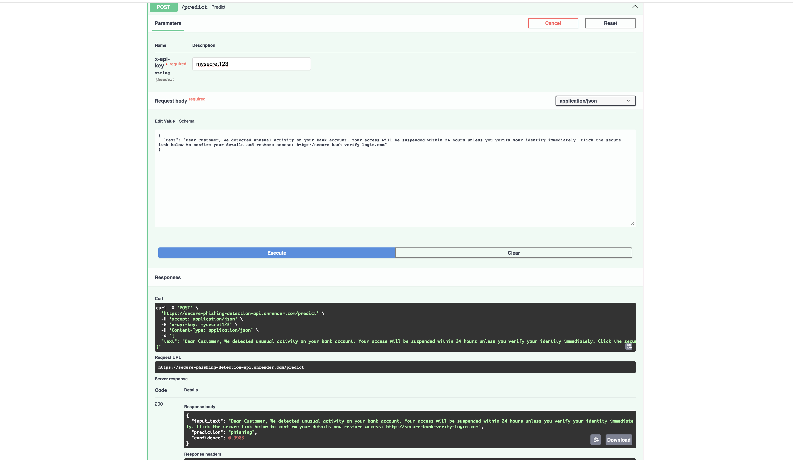
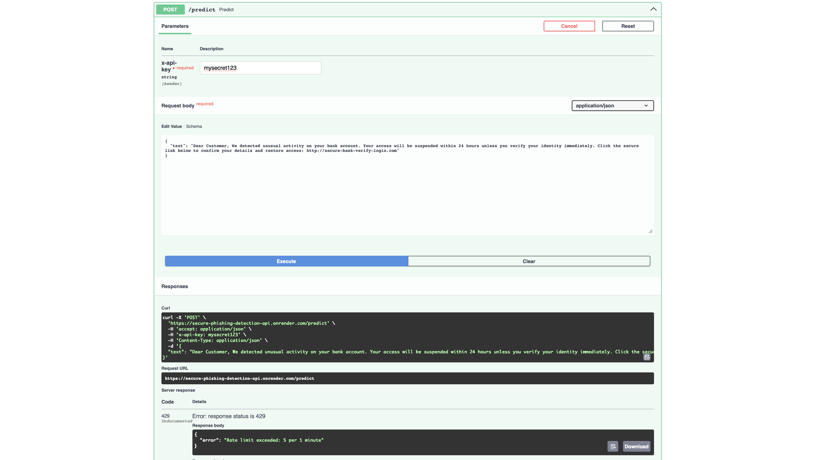
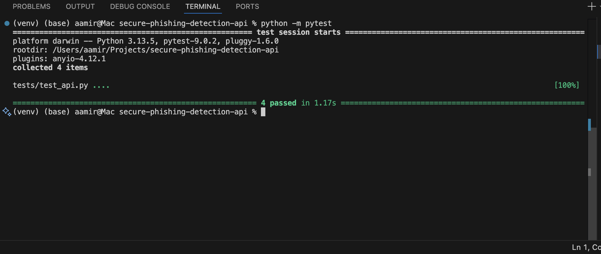
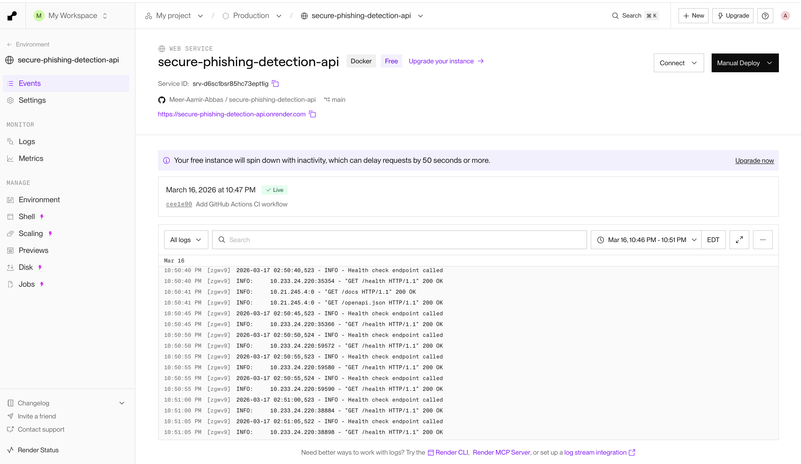

# Secure Phishing Detection API


A secure AI-powered phishing detection API built with **FastAPI**, **scikit-learn**, **Docker**, **authentication**, **rate limiting**, **logging**, **testing**, **GitHub Actions CI**, and **Render deployment**.

## Live Demo

- **API Base URL:** `https://secure-phishing-detection-api.onrender.com`
- **Swagger Docs:** `https://secure-phishing-detection-api.onrender.com/docs`
- **Health Check:** `https://secure-phishing-detection-api.onrender.com/health`

---

## Overview

This project classifies whether a given email or message is **phishing** or **legitimate** using a machine learning model trained on phishing email text.

It was designed as a production-style secure AI service with:
- ML model serving
- API key authentication
- rate limiting
- request logging
- automated testing
- Docker containerization
- CI with GitHub Actions
- live cloud deployment on Render

---

## Features

- Phishing vs legitimate text classification
- FastAPI REST API
- API key authentication using `x-api-key`
- Rate limiting to reduce abuse
- Input cleaning and validation
- Request logging
- Automated tests with `pytest`
- Dockerized deployment
- GitHub Actions CI workflow
- Live public deployment on Render

---

## Tech Stack

- **Language:** Python
- **ML:** scikit-learn, pandas, joblib
- **API:** FastAPI, Uvicorn
- **Security / Backend:** python-dotenv, SlowAPI
- **Testing:** pytest, httpx
- **DevOps:** Docker, GitHub Actions
- **Deployment:** Render

---

## Project Structure

```text
secure-phishing-detection-api/
├── .github/
│   └── workflows/
│       └── ci.yml
├── assets/
│   ├── local-fastapi-server.png
│   ├── phishing-prediction.png
│   ├── pytest-passed.png
│   ├── rate-limiting.png
│   └── render-live-deployment.png
├── app/
│   ├── __init__.py
│   ├── auth.py
│   ├── main.py
│   ├── model_loader.py
│   ├── schemas.py
│   └── utils.py
├── model/
│   └── phishing_model.pkl
├── tests/
│   └── test_api.py
├── training/
│   ├── train_model.py
│   └── phishing_email.csv
├── .dockerignore
├── .gitignore
├── Dockerfile
├── README.md
└── requirements.txt
```
## How It Works

1. A user sends suspicious text to the `/predict` endpoint.
2. The API validates and cleans the input.
3. The trained model predicts whether the text is phishing or legitimate.
4. The API returns:
   - input text
   - prediction
   - confidence score
5. The endpoint is protected with API key authentication and rate limiting.

## Model Details

The model was trained using:
	•	TF-IDF Vectorization
	•	Logistic Regression

Training dataset columns:
	•	text_combined
	•	label

Saved model:

model/phishing_model.pkl

## API Endpoints

GET /health

Checks whether the API is running.

**Response**
```json
{
  "status": "ok"
}
```
POST /predict

Predicts whether the input text is phishing or legitimate.

Required Header
x-api-key: mysecret123

Sample Request
{
  "text": "Dear Customer, We detected unusual activity on your bank account. Your access will be suspended within 24 hours unless you verify your identity immediately. Click the secure link below to confirm your details and restore access: http://secure-bank-verify-login.com"
}

Sample Response
{
  "input_text": "Dear Customer, We detected unusual activity on your bank account. Your access will be suspended within 24 hours unless you verify your identity immediately. Click the secure link below to confirm your details and restore access: http://secure-bank-verify-login.com",
  "prediction": "phishing",
  "confidence": 0.9983
}

## Security Features
	•	API key authentication
	•	Rate limiting with SlowAPI
	•	Input validation with Pydantic
	•	Secret management using environment variables
	•	Request and prediction logging
	•	Sensitive files excluded from Git tracking


### Screenshots

### Local FastAPI Server

Shows the application running successfully in local development.


### Phishing Prediction Result

The deployed API classifies a realistic suspicious email as phishing.


### Rate Limiting Protection

Shows 429 Too Many Requests after repeated calls within the configured limit.


### Automated Test Results

Pytest output showing all tests passed successfully.


### Render Live Deployment

Shows the deployed service live on Render.


### Local Setup

1. Clone the repository
git clone https://github.com/Meer-Aamir-Abbas/secure-phishing-detection-api.git
cd secure-phishing-detection-api

2. Create and activate a virtual environment

Mac / Linux
python3 -m venv venv
source venv/bin/activate

Windows
python -m venv venv
venv\Scripts\activate

3. Install dependencies
pip install -r requirements.txt

4. Create .env
API_KEY=mysecret123

5. Run the API
uvicorn app.main:app --reload

6. Open Swagger Docs
http://127.0.0.1:8000/docs

### Training the Model

To retrain the model, place the dataset at:
training/phishing_email.csv

Then run:
python training/train_model.py

### Dataset Note

The original training dataset is not included in the repository because it exceeds GitHub’s file size limit.

To retrain the model:
	1.	download the phishing email dataset separately
	2.	place it at training/phishing_email.csv
	3.	run the training script


### Running Tests
python -m pytest

Current tests cover:
	•	health endpoint
	•	successful prediction
	•	missing API key
	•	empty input validation


### Docker
Build image
docker build -t phishing-api .

### Run container
docker run -p 8000:8000 --env-file .env phishing-api

### CI/CD

### GitHub Actions automatically:
	•	installs dependencies
	•	creates a sample .env
	•	creates a sample training dataset
	•	trains the model
	•	runs tests

### Workflow file:

.github/workflows/ci.yml

### Deployment

### This project is deployed on Render as a Docker-based web service.

### Deployment includes:
	•	Dockerized application
	•	environment variable configuration
	•	health check endpoint
	•	public Swagger documentation

### Future Improvements
	•	URL-based phishing detection
	•	Suspicious indicator explanations
	•	Transformer-based NLP model
	•	Persistent audit logging
	•	Monitoring dashboard
	•	Stronger production observability


### Author

### Meer Aamir Abbas

### License

This project currently does not include a license.