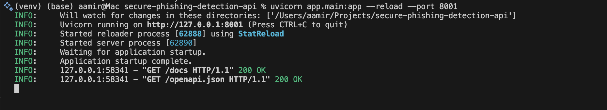
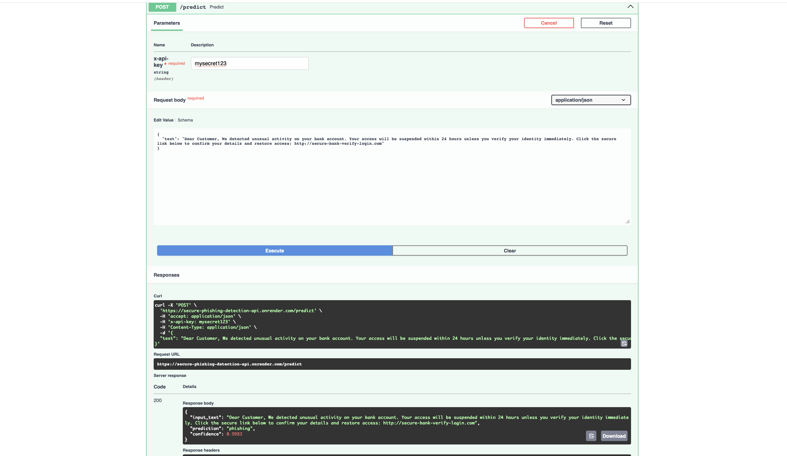
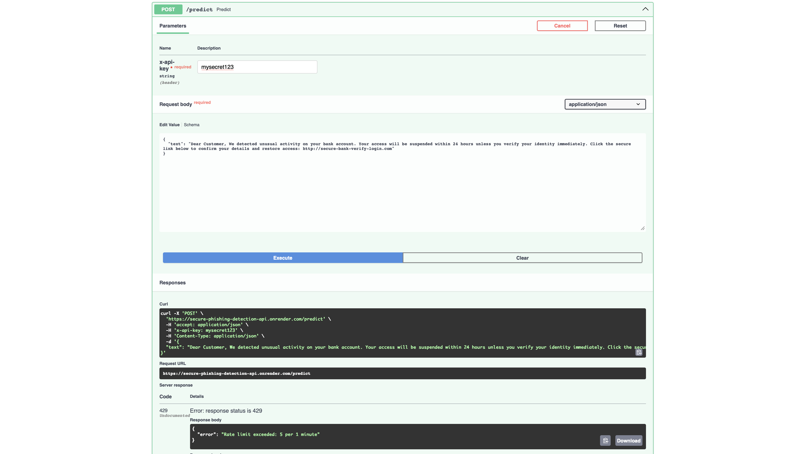
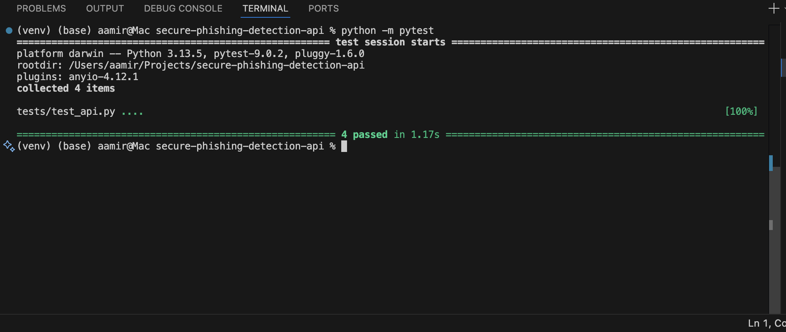
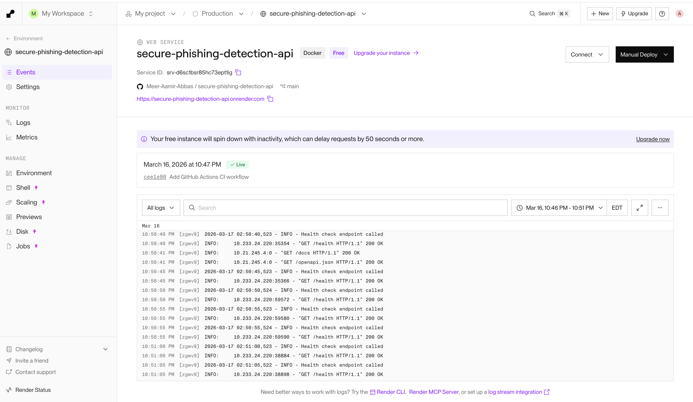

# Secure Phishing Detection API


A secure AI-powered phishing detection API built with **FastAPI**, **scikit-learn**, **Docker**, **authentication**, **rate limiting**, **logging**, **testing**, **GitHub Actions CI**, and **Render deployment**.

## Live Demo

- **API Base URL:** `https://secure-phishing-detection-api.onrender.com`
- **Swagger Docs:** `https://secure-phishing-detection-api.onrender.com/docs`
- **Health Check:** `https://secure-phishing-detection-api.onrender.com/health`

> **Privacy warning (demo):** Do **not** paste real sensitive emails, credentials, or any PII into the public demo.

---

## Overview

This project classifies whether a given email or message is **phishing** or **legitimate** using a machine learning model trained on phishing email text.

It was designed as a production-style secure AI service with:
- ML model serving
- API key authentication
- rate limiting
- request logging
- automated testing
- Docker containerization
- CI with GitHub Actions
- live cloud deployment on Render

---

## Features

- Phishing vs legitimate text classification
- FastAPI REST API
- API key authentication using `x-api-key`
- Rate limiting to reduce abuse
- Input cleaning and validation
- Request logging
- Automated tests with `pytest`
- Dockerized deployment
- GitHub Actions CI workflow
- Live public deployment on Render

---

## Tech Stack

- **Language:** Python
- **ML:** scikit-learn, pandas, joblib
- **API:** FastAPI, Uvicorn
- **Security / Backend:** python-dotenv, SlowAPI
- **Testing:** pytest, httpx
- **DevOps:** Docker, GitHub Actions
- **Deployment:** Render

---

## Project Structure

```text
secure-phishing-detection-api/
├── .github/
│   └── workflows/
│       └── ci.yml
├── assets/
│   ├── local-fastapi-server.png
│   ├── phishing-prediction.png
│   ├── pytest-passed.png
│   ├── rate-limiting.png
│   └── render-live-deployment.png
├── app/
│   ├── __init__.py
│   ├── auth.py
│   ├── main.py
│   ├── model_loader.py
│   ├── schemas.py
│   └── utils.py
├── model/
│   └── phishing_model.pkl
├── tests/
│   └── test_api.py
├── training/
│   ├── train_model.py
│   └── phishing_email.csv
├── .dockerignore
├── .gitignore
├── Dockerfile
├── README.md
└── requirements.txt
```
## How It Works

1. A user sends suspicious text to the `/predict` endpoint.
2. The API validates and cleans the input.
3. The trained model predicts whether the text is phishing or legitimate.
4. The API returns:
   - input text
   - prediction
   - confidence score
5. The endpoint is protected with API key authentication and rate limiting.

## Model Details

The model was trained using:
- TF-IDF Vectorization
- Logistic Regression

Training dataset columns:
- `text_combined`
- `label`

Saved model:

`model/phishing_model.pkl`

### Local model requirement

The API loads `model/phishing_model.pkl` at startup. **You must have this file locally before running** `uvicorn app.main:app --reload`.

- If `model/phishing_model.pkl` is already present, you can run the API immediately after setting `API_KEY`.
- If it is missing, train it locally (see [Training the Model](#training-the-model)) or use the same approach as CI (it generates a small CSV and trains a model before running tests).

## API Endpoints

### GET `/health`

Checks whether the API is running.

**Response**
```json
{
  "status": "ok"
}
```

### POST `/predict`

Predicts whether the input text is phishing or legitimate.

**Headers**

- `x-api-key`: your API key (required)

**Request body**

```json
{
  "text": "Dear Customer, We detected unusual activity on your bank account. Your access will be suspended within 24 hours unless you verify your identity immediately. Click the secure link below to confirm your details and restore access: http://secure-bank-verify-login.com"
}
```

**Sample response**

```json
{
  "input_text": "Dear Customer, We detected unusual activity on your bank account. Your access will be suspended within 24 hours unless you verify your identity immediately. Click the secure link below to confirm your details and restore access: http://secure-bank-verify-login.com",
  "prediction": "phishing",
  "confidence": 0.9983
}
```

### Status codes

- **200**: success
- **400**: cleaned input is empty (e.g. empty or whitespace-only text)
- **401**: invalid API key
- **422**: request validation error (e.g. missing `x-api-key`, malformed JSON, or `text` too long)
- **429**: rate limit exceeded

## Security Features
- API key authentication
- Rate limiting with SlowAPI
- Input validation with Pydantic
- Secret management using environment variables
- Request and prediction logging
- Sensitive files excluded from Git tracking


### Screenshots

### Local FastAPI Server

Shows the application running successfully in local development.


### Phishing Prediction Result

The deployed API classifies a realistic suspicious email as phishing.


### Rate Limiting Protection

Shows 429 Too Many Requests after repeated calls within the configured limit.


### Automated Test Results

Pytest output showing all tests passed successfully.


### Render Live Deployment

Shows the deployed service live on Render.


### Local Setup

1. Clone the repository

```bash
git clone https://github.com/Meer-Aamir-Abbas/secure-phishing-detection-api.git
cd secure-phishing-detection-api
```

2. Create and activate a virtual environment

Mac / Linux
```bash
python3 -m venv venv
source venv/bin/activate
```

Windows
```bash
python -m venv venv
venv\Scripts\activate
```

3. Install dependencies
```bash
pip install -r requirements.txt
```

4. Create `.env` (required)

Generate a strong API key:

```bash
openssl rand -hex 32
```

Create a `.env` file at the project root:

```bash
API_KEY=your-generated-hex-key-here
```

> `API_KEY` is **required**. The app fails fast at startup if it is missing or empty.

5. Run the API
```bash
uvicorn app.main:app --reload
```

6. Open Swagger Docs
```bash
http://127.0.0.1:8000/docs
```

### Training the Model

If you do not already have `model/phishing_model.pkl`, retrain the model.

1. Place the dataset at:

```bash
training/phishing_email.csv
```

2. Run:

```bash
python training/train_model.py
```

### Dataset Note

The original training dataset is not included in the repository because it exceeds GitHub’s file size limit.

To retrain the model:
- download the phishing email dataset separately
- place it at `training/phishing_email.csv`
- run `python training/train_model.py`


### Running Tests
```bash
python -m pytest
```

### Current tests cover:
- health endpoint
- successful prediction
- missing API key
- empty/whitespace-only input validation
- invalid API key
- oversized input validation


### Docker
Build image
```bash
docker build -t phishing-api .
```

### Run container
```bash
docker run -p 8000:8000 --env-file .env phishing-api
```

### CI/CD

### GitHub Actions automatically:
- installs dependencies
- creates a sample `.env`
- creates a sample training dataset
- trains the model
- runs tests

### Workflow file:
```bash
.github/workflows/ci.yml
```

### Deployment

### This project is deployed on Render as a Docker-based web service.

### Deployment includes:
- Dockerized application
- environment variable configuration
- health check endpoint
- public Swagger documentation

### Future Improvements
- URL-based phishing detection
- Suspicious indicator explanations
- Transformer-based NLP model
- Persistent audit logging
- Monitoring dashboard
- Stronger production observability


### Author

### Meer Aamir Abbas

### License

This project currently does not include a license.